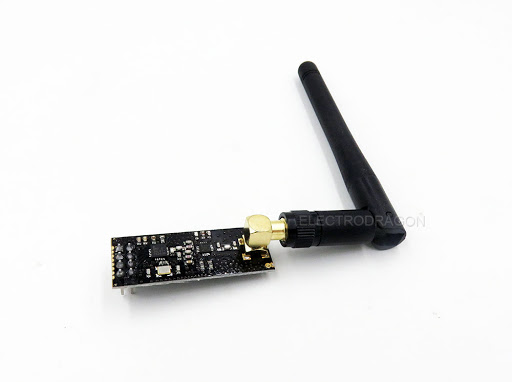
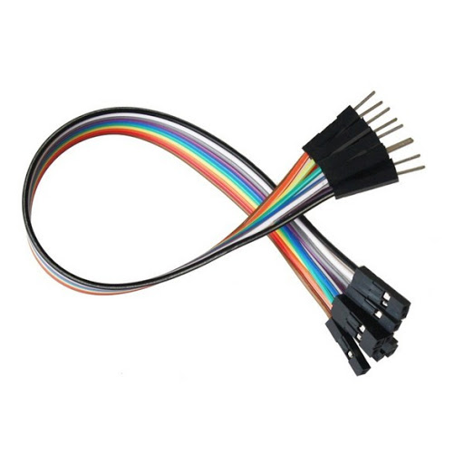
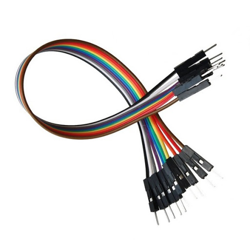
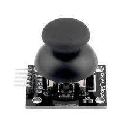
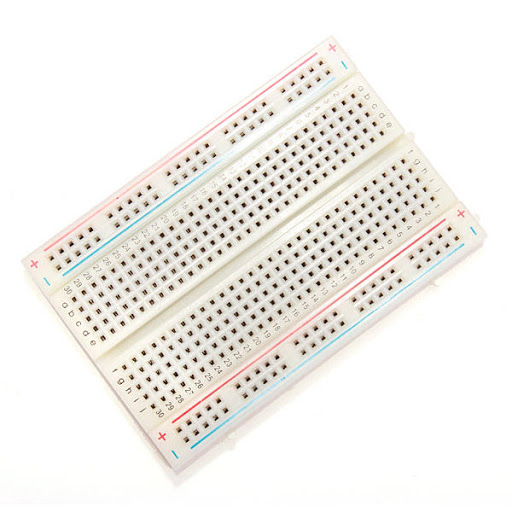
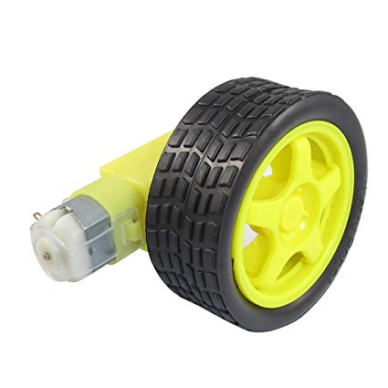
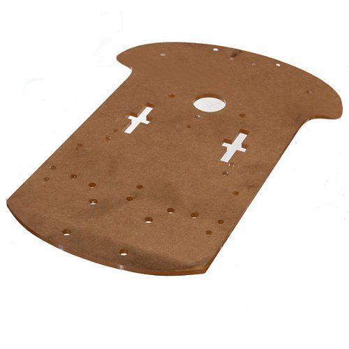
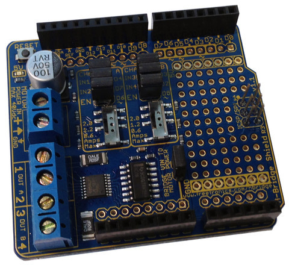
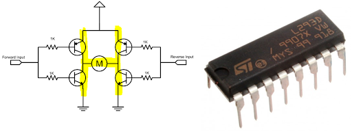
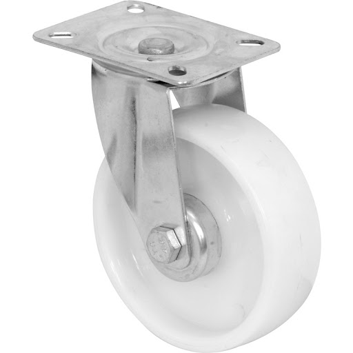

# How to make a RC car
## A tutorial on how to create a remote controlled car using arduinos.

This guide outlines how to setup the controller and motorised components of an RC vehicle, this guide can be used as part of an outline for how to create a DIY remote control car. Now if you haven’t checked out the tutorial on how to create wireless communications we’d recommend you check it out → here - Its not compulsory to complete this tutorial but it will give you a better idea of how the RC car functions.

### Components:
* 2 arduinos (one for transmitting and one for receiving)


* 2 nRF24L01+ Wireless Modules (you can use other modules but you will have to figure out how to wire them yourself)



* Male to Female Jump wires (you’ll need 10)



* Male to Male Jumper wires



* 2 joysticks



* 1 bread board



* 2 motors(with wheels)



* Chassis base



* H-bridge (using a shield is easier but we will cover both in this tutorial)





* 1 swivel caster



There are many other ways to create an RC car, this is merely one of many potential designs 

### Step 1- Chassis building:
It would be fair to say that if the chassis doesn’t work your likely hood of creating a successful remote controlled car is slim.


(insert image of chassis)


### Step 2- Circuitry
&nbsp;&nbsp;&nbsp;&nbsp;&nbsp;&nbsp;**Controller**

&nbsp;&nbsp;&nbsp;&nbsp;&nbsp;&nbsp;**Car**


Connect the car circuitry to the chassis

### Step 3- Code
&nbsp;&nbsp;&nbsp;&nbsp;&nbsp;&nbsp;**Controller code**

```  
//Include Libraries
#include <SPI.h>
#include <nRF24L01.h>
#include <RF24.h>

//create an RF24 object
RF24 radio(9, 8);  // CE, CSN

//address through which two modules communicate.
const byte address[6] = "00001";

void setup()
{
  Serial.begin(9600);
  radio.begin();
  
  //set the address
  radio.openWritingPipe(address);
  
  //Set module as transmitter
  radio.stopListening();
}
void loop()
{
  
  //Serial.println(analogRead(0));
  //Serial.println(analogRead(1));
  int left=map(analogRead(1), 0, 1023, -255, 254);
  int right=map(analogRead(0), 0, 1023, -255, 254);
  Serial.print(left);
  Serial.print(right);
  int power[2]={left,right};
  //Send message to receiver
  radio.write(&power, sizeof(power));
}
```

&nbsp;&nbsp;&nbsp;&nbsp;&nbsp;&nbsp;**RC Car code**

```
//Include Libraries
#include <SPI.h>
#include <nRF24L01.h>
#include <RF24.h>

//create an RF24 object
RF24 radio(9, 8);  // CE, CSN

//address through which two modules communicate.
const byte address[6] = "00001";

const int channel_a_enable  = 6;
const int channel_a_input_1 = 4;
const int channel_a_input_2 = 7;
const int channel_b_enable  = 5;
const int channel_b_input_3 = 3;
const int channel_b_input_4 = 2;

void setup()
{
  while (!Serial);
    Serial.begin(9600);

  pinMode( channel_a_enable, OUTPUT );  // Channel A enable
  pinMode( channel_a_input_1, OUTPUT ); // Channel A input 1
  pinMode( channel_a_input_2, OUTPUT ); // Channel A input 2
  
  pinMode( channel_b_enable, OUTPUT );  // Channel B enable
  pinMode( channel_b_input_3, OUTPUT ); // Channel B input 3
  pinMode( channel_b_input_4, OUTPUT ); // Channel B input 4
  radio.begin();
  
  //set the address
  radio.openReadingPipe(0, address);
  
  //Set module as receiver
  radio.startListening();
}
int forward=0;
int side=0;
void loop()
{
  Serial.print("OOF");
  if (radio.available())
  {
    Serial.print("hello?");
    int text[32] = {0};
    radio.read(&text, sizeof(text));
    //Serial.println(text[0]);
    //Serial.println(text[1]);
    forward=text[0];
    side=text[1];

    if(forward<0)
    {
      float power=-forward*1/float(255);
      if(side<0)
      {
        float left=(side+255)*1/float(255);
        analogWrite(channel_a_enable, 255*power);
        digitalWrite( channel_a_input_1, LOW);
        digitalWrite( channel_a_input_2, HIGH);

        analogWrite(channel_b_enable, 255*power*left);
        digitalWrite( channel_b_input_3, HIGH);
        digitalWrite( channel_b_input_4, LOW);
      }
      else if(side>=0)
      {
        float left=-(side-255)*1/float(255);
        analogWrite(channel_a_enable, 255*power*left);
        digitalWrite( channel_a_input_1, LOW);
        digitalWrite( channel_a_input_2, HIGH);

        analogWrite(channel_b_enable, 255*power);
        digitalWrite( channel_b_input_3, HIGH);
        digitalWrite( channel_b_input_4, LOW);
      }
    }
    else if(forward>=0)
    {
      float power=forward*1/float(255);
      if(side<0)
      {
        float left=(side+255)*1/float(255);
        analogWrite(channel_a_enable, 255*power);
        digitalWrite( channel_a_input_1, HIGH);
        digitalWrite( channel_a_input_2, LOW);

        analogWrite(channel_b_enable, 255*power*left);
        digitalWrite( channel_b_input_3, LOW);
        digitalWrite( channel_b_input_4, HIGH);        
      }
      else if(side>=0)
      {
        float left=-(side-255)*1/float(255);
        analogWrite(channel_a_enable, 255*power*left);
        digitalWrite( channel_a_input_1, HIGH);
        digitalWrite( channel_a_input_2, LOW);

        analogWrite(channel_b_enable, 255*power);
        digitalWrite( channel_b_input_3, LOW);
        digitalWrite( channel_b_input_4, HIGH);        
      }
    }
  }
}
```

### conclusion


Problems are very common, especially if this is your first project working with wireless communications
(list out some of the problems)


Now that we are done consider additions that you could make to this design to make it epic.
