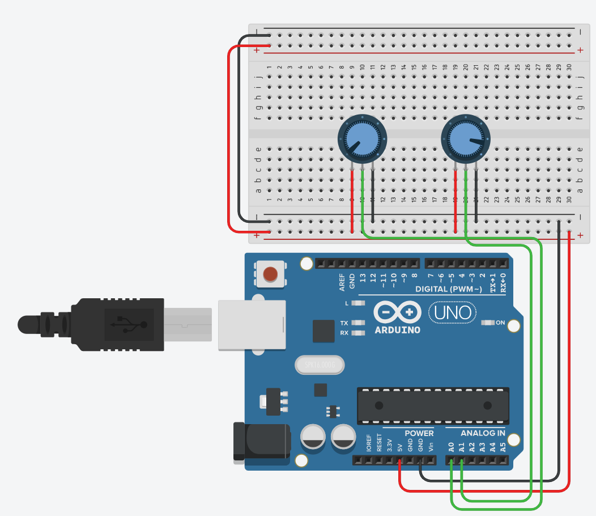
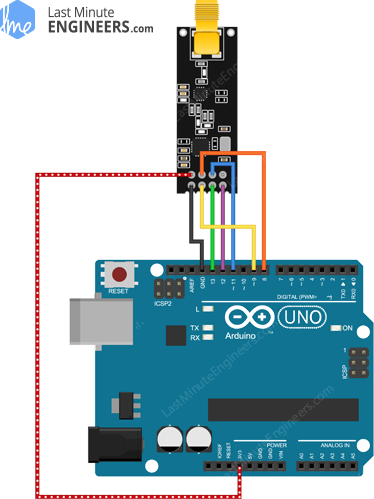

# How to make a RC car
## A tutorial on how to create a remote controlled car using arduinos.

This guide outlines how to setup the controller and motorised components of an RC vehicle, this guide can be used as part of an outline for how to create a DIY remote control car. Now if you haven’t checked out the tutorial on how to create wireless communications we’d recommend you check it out → here - Its not compulsory to complete this tutorial but it will give you a better idea of how the RC car functions.

## Components:
* 2 arduinos (one for transmitting and one for receiving)


* 2 nRF24L01+ Wireless Modules (you can use other modules but you will have to figure out how to wire them yourself)


* Male to Female Jump wires (you’ll need 10)


* Male to Male Jumper wires


* 2 joysticks


* 1 bread board


* 2 motors(with wheels)


* Chassis base


* H-bridge (using a shield is easier but we will cover both in this tutorial)


* 1 swivel caster


There are many other ways to create an RC car, this is merely one of many potential designs 

## Step 1- Chassis building:
It would be fair to say that if the chassis doesn’t work your likely hood of creating a successful remote controlled car is slim.


(insert image of chassis)


### Step 2- Circuitry
&nbsp;&nbsp;&nbsp;&nbsp;&nbsp;&nbsp;###**Controller**

The way the controller will work is by collecting 2 analog signals; one to indicate speed and the other to indicate direction. We will also have to construct the controller in a way where we can output the signals to the car



The radio frequency control relies on the nrf24L01 Transciver module to transimit packages of data from the controller


Thats is all that is required to control the cars circuitry which i will know tell you how to construct

&nbsp;&nbsp;&nbsp;&nbsp;&nbsp;&nbsp;###**Car**

The cars circuitry will require a h-bridge which will control the motors therefore making the car maneouver aswell as an reciever that will recieve information transmitted from the controller which can then be used to move the car.

There are two h-bridges that we can use; sheild or self made.

**sheild**: sheild is the easier of the two and only requires you to place the sheild upon your arduino and connect the two motors and power supplies to its connections

**Self made**: self made is harder but achieves the same result


The car also requires a wireless connection to the controller so we must implement a way for them to communicate. Convieiniently it is pretty easy as we can reuse the controllers transmitter circuit to create this reciever


now that we have set up the circuitry we can now code the two arduinos so that we create an remote control car

## Step 3- Code
before we can do any coding we are going to require some Libraries in order to use radio communication which you can find below:
SPI: https://github.com/PaulStoffregen/SPI/blob/master/SPI.h
RF24: https://github.com/nRF24/RF24

Now we are truly ready to start coding, lets begin with the controller's code

&nbsp;&nbsp;&nbsp;&nbsp;&nbsp;&nbsp;###**Controller code**

```  
//Include Libraries
#include <SPI.h>
#include <nRF24L01.h>
#include <RF24.h>

//create an RF24 object
RF24 radio(9, 8);  // CE, CSN

//address through which two modules communicate.
const byte address[6] = "00001";

void setup()
{
  Serial.begin(9600);
  radio.begin();
  
  //set the address
  radio.openWritingPipe(address);
  
  //Set module as transmitter
  radio.stopListening();
}
void loop()
{
  
  //Serial.println(analogRead(0));
  //Serial.println(analogRead(1));
  int left=map(analogRead(1), 0, 1023, -255, 254);
  int right=map(analogRead(0), 0, 1023, -255, 254);
  Serial.print(left);
  Serial.print(right);
  int power[2]={left,right};
  //Send message to receiver
  radio.write(&power, sizeof(power));
}
```
[Link to transmitter Source code](Code/CarTransmitterCode.ino)

now if you don't understand what is happening, no worries here is quick and simple summary of what is happening here:
```
//Include Libraries
#include <SPI.h>
#include <nRF24L01.h>
#include <RF24.h>
```
The first few lines of code are header files which are used to declare the libaries it doesn't really matter what they do but just make sure you understand that they declare useful information needed for you arudino to transmit information.
```
//create an RF24 object
RF24 radio(9, 8);  // CE, CSN

//address through which two modules communicate.
const byte address[6] = "00001";
```
The next lines create an RF24 object called radio with digital pin parameters 9 and 8 oresponding to the transmitters CE and CSN respectivly.
We also define an adress(in this case 1) which this arduino will transmit over, it is important that the transmitters address and the recievers address is the same for the communication to work.
```
radio.begin();

//set the address
radio.openWritingPipe(address);

//Set module as transmitter
radio.stopListening();
```
Within the void setup function we encounter this code. The radio.begin(); statement runs a member function from our RF24 object radio defined earlier, the member function begins operation of the RF24 chip. the radio.openWritingPipe(address); statement runs another member function that takes our address from earlier and the pipe at the address for writing(transmitting information). The final line radio.stopListening(); then Stops the listening of incoming messages which is the final step needed before we can start transmitting our own data.
```
int left=map(analogRead(1), 0, 1023, -255, 254);
int right=map(analogRead(0), 0, 1023, -255, 254);

int power[2]={left,right};
//Send message to receiver
radio.write(&power, sizeof(power));
```
Here is the final statements nessesary to understand this code. The first 2 functions both read the 2 analog values that we are supplying to pins 0 and 1 and maps it between -255 to 254 before assignment. these 2 values are then put in an array called power in the thrid statement. the final statement here is radio.write(&power, sizeof(power)); where we use the RF24 object, radio to finally transmit our power object over the RF24 component. this process will repeat indefinetly(forever unless interupted) meaning that communication should occur constantly.

now that we have completed the transmitting of data we should probably see how to recieve and intrepret this information.

&nbsp;&nbsp;&nbsp;&nbsp;&nbsp;&nbsp;###**RC Car code**

```
//Include Libraries
#include <SPI.h>
#include <nRF24L01.h>
#include <RF24.h>

//create an RF24 object
RF24 radio(9, 8);  // CE, CSN

//address through which two modules communicate.
const byte address[6] = "00001";

const int channel_a_enable  = 6;
const int channel_a_input_1 = 4;
const int channel_a_input_2 = 7;
const int channel_b_enable  = 5;
const int channel_b_input_3 = 3;
const int channel_b_input_4 = 2;

void setup()
{
  while (!Serial);
    Serial.begin(9600);

  pinMode( channel_a_enable, OUTPUT );  // Channel A enable
  pinMode( channel_a_input_1, OUTPUT ); // Channel A input 1
  pinMode( channel_a_input_2, OUTPUT ); // Channel A input 2
  
  pinMode( channel_b_enable, OUTPUT );  // Channel B enable
  pinMode( channel_b_input_3, OUTPUT ); // Channel B input 3
  pinMode( channel_b_input_4, OUTPUT ); // Channel B input 4
  radio.begin();
  
  //set the address
  radio.openReadingPipe(0, address);
  
  //Set module as receiver
  radio.startListening();
}
int forward=0;
int side=0;
void loop()
{
  if (radio.available())
  {
    int text[32] = {0};
    radio.read(&text, sizeof(text));
    //Serial.println(text[0]);
    //Serial.println(text[1]);
    forward=text[0];
    side=text[1];

    if(forward<0)
    {
      float power=-forward*1/float(255);
      if(side<0)
      {
        float left=(side+255)*1/float(255);
        analogWrite(channel_a_enable, 255*power);
        digitalWrite( channel_a_input_1, LOW);
        digitalWrite( channel_a_input_2, HIGH);

        analogWrite(channel_b_enable, 255*power*left);
        digitalWrite( channel_b_input_3, HIGH);
        digitalWrite( channel_b_input_4, LOW);
      }
      else if(side>=0)
      {
        float left=-(side-255)*1/float(255);
        analogWrite(channel_a_enable, 255*power*left);
        digitalWrite( channel_a_input_1, LOW);
        digitalWrite( channel_a_input_2, HIGH);

        analogWrite(channel_b_enable, 255*power);
        digitalWrite( channel_b_input_3, HIGH);
        digitalWrite( channel_b_input_4, LOW);
      }
    }
    else if(forward>=0)
    {
      float power=forward*1/float(255);
      if(side<0)
      {
        float left=(side+255)*1/float(255);
        analogWrite(channel_a_enable, 255*power);
        digitalWrite( channel_a_input_1, HIGH);
        digitalWrite( channel_a_input_2, LOW);

        analogWrite(channel_b_enable, 255*power*left);
        digitalWrite( channel_b_input_3, LOW);
        digitalWrite( channel_b_input_4, HIGH);        
      }
      else if(side>=0)
      {
        float left=-(side-255)*1/float(255);
        analogWrite(channel_a_enable, 255*power*left);
        digitalWrite( channel_a_input_1, HIGH);
        digitalWrite( channel_a_input_2, LOW);

        analogWrite(channel_b_enable, 255*power);
        digitalWrite( channel_b_input_3, LOW);
        digitalWrite( channel_b_input_4, HIGH);        
      }
    }
  }
}
```
[Link to reciever Source code](Code/CarRecieverCode.ino)

Now I will provide a quick synopsis on how the car's reciever code functions:
```
//Include Libraries
#include <SPI.h>
#include <nRF24L01.h>
#include <RF24.h>

//create an RF24 object
RF24 radio(9, 8);  // CE, CSN

//address through which two modules communicate.
const byte address[6] = "00001";
```
just like the transmitter's code we include our libraries headers, initialise a RF24 object and an adress(which is the same as the transmitters adress).
```
const int channel_a_enable  = 6;
const int channel_a_input_1 = 4;
const int channel_a_input_2 = 7;
const int channel_b_enable  = 5;
const int channel_b_input_3 = 3;
const int channel_b_input_4 = 2;

...

  pinMode( channel_a_enable, OUTPUT );  // Channel A enable
  pinMode( channel_a_input_1, OUTPUT ); // Channel A input 1
  pinMode( channel_a_input_2, OUTPUT ); // Channel A input 2
  
  pinMode( channel_b_enable, OUTPUT );  // Channel B enable
  pinMode( channel_b_input_3, OUTPUT ); // Channel B input 3
  pinMode( channel_b_input_4, OUTPUT ); // Channel B input 4
```
Where the code starts to deviate from the transcievers is with the initialisation of the pins that we use to control our H-bridge
```
  radio.begin();
  
  //set the address
  radio.openReadingPipe(0, address);
  
  //Set module as receiver
  radio.startListening();
```
Once again we run radio.begin() to begin our chip but this time we run radio.openReadingPipe(0, address); which makes sense as this time we are reading instead of writing from the address. We then run radio.startListening(); which ends our recievers initialisation process allowing us to now recieve information from the transmitter.
```
if (radio.available())
  {
    int text[32] = {0};
    radio.read(&text, sizeof(text));
    forward=text[0];
    side=text[1];
```
This snippet begins with and if statement that only runs if there is data available to read. We then read the information into an int array of length 32 using radio.read(&text, sizeof(text)) this text is then organised into individual variables.

The last pieces of in short i won't talk about in to much detail but what it does is it checks the values and accordingly moves the motors with respect to the values so that it can be controlled. I'm not going to analyse how this works exactly as I feel it is not an effective way to peform this function and there is definitatly room to improve this code which I challenge you to explore.

Now that that is finished congratulations you have hopefully finished your remote control car have fun. If it is not working don't worry its fine and in the end your probably going to learn something from it, I'd reccomend you go back and make sure that your circuitry is properly configured, It is also a possibility that I have made a mistake somewhere so I encourage you to ask questions and to inovate on my configuration, good luck.
## conclusion


Problems are very common, especially if this is your first project working with wireless communications
(list out some of the problems)


Now that we are done consider additions that you could make to this design to make it epic.
